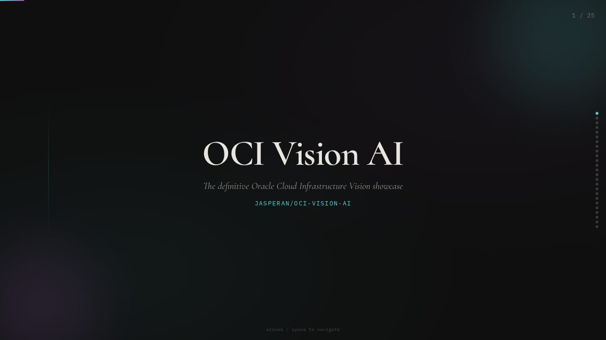
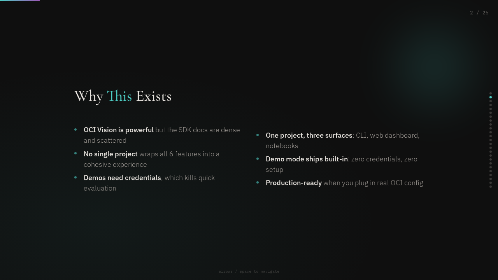
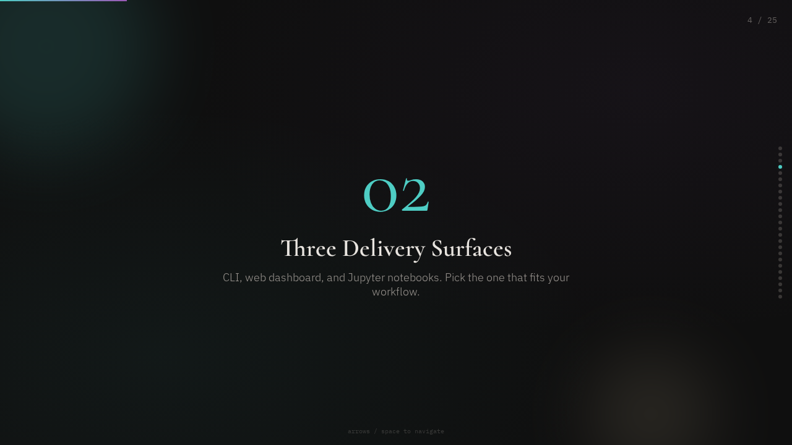
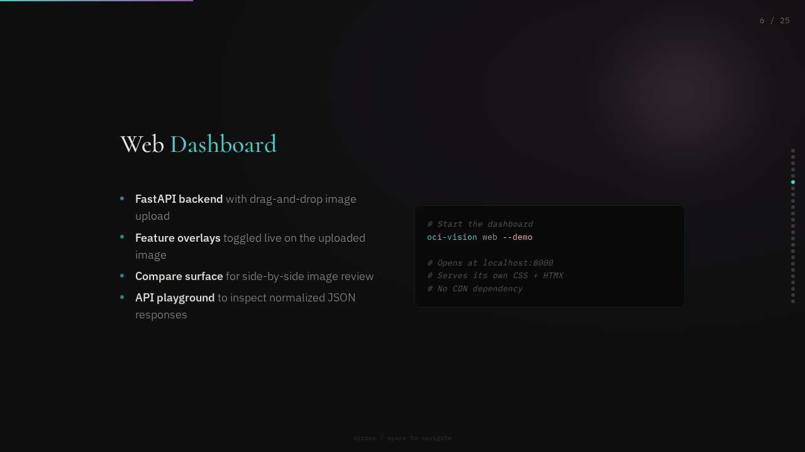
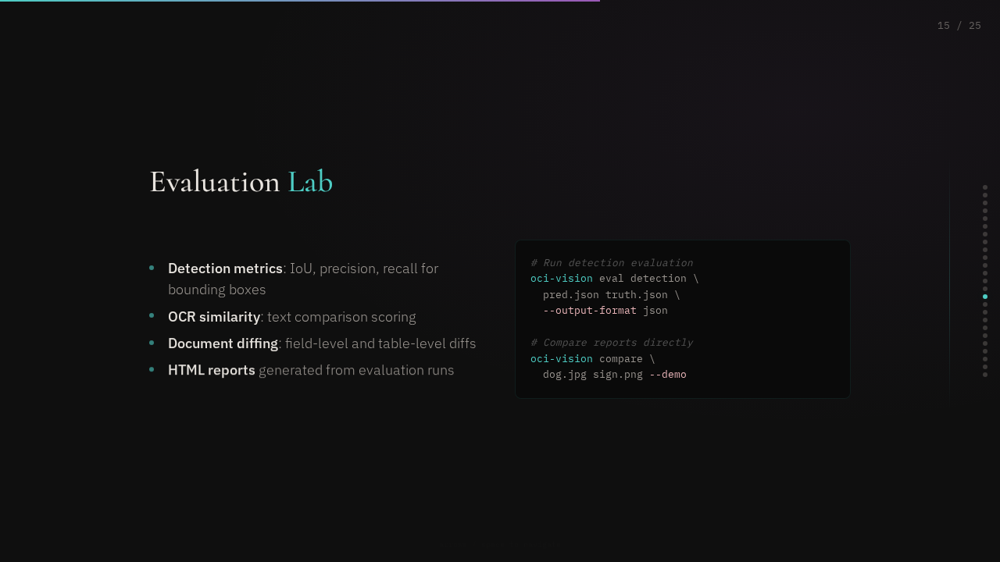
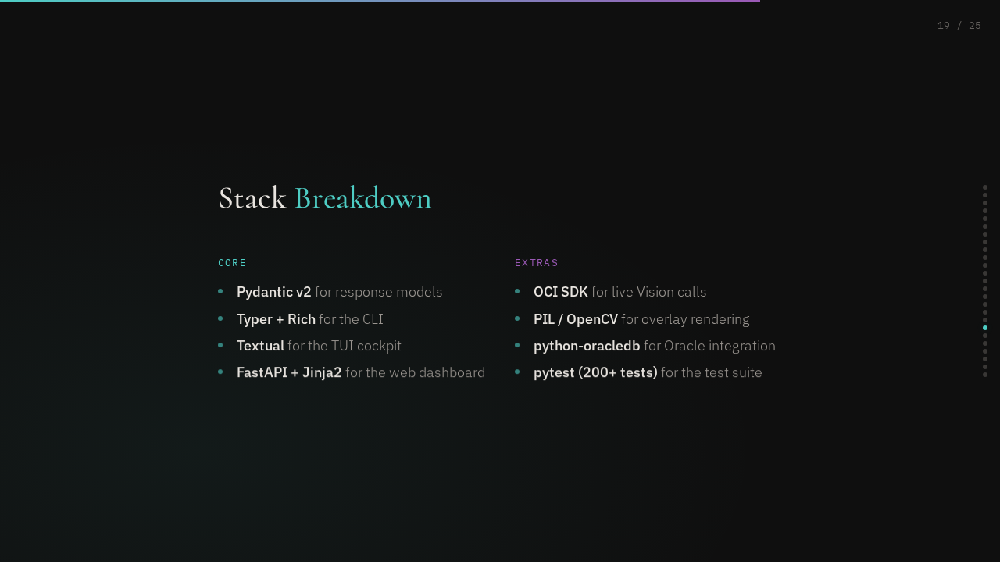

# OCI Vision AI

[](https://github.com/jasperan/oci-vision-ai/actions/workflows/build-install-smoke.yml)
[](https://github.com/jasperan/oci-vision-ai/actions/workflows/dependency-audit.yml)

The definitive Oracle Cloud Infrastructure Vision AI showcase.

Analyse images with six OCI Vision features through a polished CLI, an interactive web dashboard, or hands-on Jupyter notebooks. Demo mode runs without OCI credentials and stays offline-friendly across the shipped CLI, cockpit, notebooks, and web UI.

<div align="center">

**[View Interactive Presentation](docs/slides/presentation.html)** | Animated overview of the project

</div>

<table>
<tr>
<td></td>
<td></td>
</tr>
<tr>
<td></td>
<td></td>
</tr>
<tr>
<td></td>
<td></td>
</tr>
</table>

---

## Features

**Vision capabilities**

- **Image Classification** -- label images with confidence scores
- **Object Detection** -- locate objects with bounding polygons
- **Text / OCR** -- extract printed and handwritten text
- **Face Detection** -- find faces and facial landmarks
- **Document AI** -- extract fields and tables from invoices, receipts, and forms
- **Custom Models** -- bring your own OCI Vision model

**Delivery surfaces**

- **CLI** (`oci-vision`) -- Rich-formatted terminal output, JSON and HTML reports, compare and batch analysis commands, workflow packs, demo recording, and the Textual demo cockpit
- **Web Dashboard** -- FastAPI + drag-and-drop upload with toggleable feature overlays, a real compare page, API playground, and report pages with generated insight cards
- **Jupyter Notebooks** -- seven guided walkthroughs with inline visualisations

**Platform extras**

- **Evaluation Lab** -- detection metrics, OCR similarity, and document diffing
- **Workflow Packs** -- receipt intake, shelf audit, inspection, and archive search
- **Oracle Database 26ai Integration** -- optional run storage and semantic search with local Oracle Database Free

**Demo mode** -- fixture-backed cached responses, one `--demo` flag, and honest failure for unsupported demo assets instead of silent fallback.

---

## Quick Start

<!-- one-command-install -->
> **One-command install** — clone, configure, and run in a single step:
>
> ```bash
> curl -fsSL https://raw.githubusercontent.com/jasperan/oci-vision-ai/main/install.sh | bash
> ```
>
> <details><summary>Advanced options</summary>
>
> Override install location:
> ```bash
> PROJECT_DIR=/opt/myapp curl -fsSL https://raw.githubusercontent.com/jasperan/oci-vision-ai/main/install.sh | bash
> ```
>
> Or install manually:
> ```bash
> git clone https://github.com/jasperan/oci-vision-ai.git
> cd oci-vision-ai
> # See below for setup instructions
> ```
> </details>


```bash
pip install -e .
oci-vision analyze dog_closeup.jpg --demo
oci-vision compare dog_closeup.jpg sign_board.png --demo --output-format json
oci-vision batch dog_closeup.jpg sign_board.png invoice_demo.png --demo --output-format json
oci-vision cockpit --demo
oci-vision web --demo
```

**Install options**

- `pip install -e .` — demo CLI, cockpit, and web dashboard
- `pip install -e ".[live]"` — add OCI SDK for live mode
- `pip install -e ".[notebooks]"` — add notebook tooling
- `pip install -e ".[all]"` — everything

---

## CI and Security

This repo ships with 2 guardrails in GitHub Actions:

- [`build-install-smoke`](https://github.com/jasperan/oci-vision-ai/actions/workflows/build-install-smoke.yml) checks the package build, install flow, demo CLI paths, compare/batch commands, cockpit screenshot generation, and the shipped web assets.
- [`dependency-audit`](https://github.com/jasperan/oci-vision-ai/actions/workflows/dependency-audit.yml) audits the **base install path** (`pip install -e .`) and uploads a markdown report artifact on every run.

If you want the policy details, current allowlist, and the still-unresolved `pygments` advisory, read [`docs/security/dependency-audit.md`](docs/security/dependency-audit.md).

---

## Textual Demo Cockpit

The cockpit is a polished terminal control room for the project. It gives you gallery browsing, feature toggles, workflow launchers, run history, lightweight compare mode, and export actions in one screen.

```bash
# Launch the interactive cockpit
oci-vision cockpit --demo

# Start on a specific gallery image with preselected features
oci-vision cockpit --demo --image dog_closeup.jpg --features classification,detection

# Generate a deterministic SVG capture for docs or demos
oci-vision cockpit --demo \
  --image dog_closeup.jpg \
  --features classification,detection \
  --screenshot cockpit.svg
```

### Cockpit highlights

- **Gallery-first flow** -- jump between bundled demo fixtures without typing commands
- **Feature toggles** -- turn OCR, detection, faces, document AI, or classification on and off live
- **Workflow rail** -- launch receipt, shelf-audit, inspection, and archive-search runs from the same screen
- **Compare panel** -- see lightweight deltas against the previous run
- **Export actions** -- write JSON, HTML, and overlay artifacts from the cockpit

### Cockpit screenshots

The checked-in PNGs below are rendered from deterministic SVG captures generated by the shipped cockpit command.

**Overview**


**Workflow panel**


A companion HTML slide deck lives at [docs/slides/oci-vision-demo-cockpit.html](https://github.com/jasperan/oci-vision-ai/blob/main/docs/slides/oci-vision-demo-cockpit.html).

## CLI Usage

Every command accepts `--demo` to run without OCI credentials.

```bash
# Full analysis (all features available for the fixture)
oci-vision analyze dog_closeup.jpg --demo
oci-vision analyze sign_board.png --demo
oci-vision analyze invoice_demo.png --demo

# Individual features
oci-vision classify dog_closeup.jpg --demo
oci-vision detect dog_closeup.jpg --demo
oci-vision ocr sign_board.png --demo
oci-vision faces portrait_demo.png --demo
oci-vision document invoice_demo.png --demo

# Compare two reports
oci-vision compare dog_closeup.jpg sign_board.png --demo --output-format json

# Batch summary across multiple fixtures
oci-vision batch dog_closeup.jpg sign_board.png invoice_demo.png --demo --output-format json

# Browse the demo gallery
oci-vision gallery

# Evaluation lab
oci-vision eval detection pred.json truth.json --output-format json

# Workflow packs
oci-vision workflow receipt invoice_demo.png --demo
oci-vision workflow shelf dog_closeup.jpg --demo

# Record a new fixture into the demo gallery
oci-vision record-demo ./sample.png --feature text --response-json ./response.json

# Optional Oracle-backed semantic search
oci-vision search-runs "invoice number"

# JSON output
oci-vision analyze dog_closeup.jpg --demo --output-format json

# Save annotated overlay image
oci-vision analyze dog_closeup.jpg --demo --save-overlay annotated.png
```

Run `oci-vision --help` for the full option reference.

---

## Web Dashboard

```bash
oci-vision web --demo
```

Opens at **http://localhost:8000**. Drag and drop an image or pick one from the built-in gallery, toggle feature-specific overlays, inspect normalized JSON in the API playground, open gallery-backed report pages, and use the compare surface for side-by-side review.

**Demo-mode upload note:** the browser can only return honest demo results for the bundled fixture names (`dog_closeup.jpg`, `sign_board.png`, `portrait_demo.png`, `invoice_demo.png`). Arbitrary uploads require live mode.

**Offline note:** the web dashboard now serves its own CSS and HTMX bundle from local static assets, so demo mode no longer depends on public CDNs.

---

## Notebooks

| # | Notebook | Description |
|---|----------|-------------|
| 01 | `01_quickstart.ipynb` | End-to-end walkthrough -- classify, detect, OCR in one notebook |
| 02 | `02_classification.ipynb` | Deep dive into image classification with threshold tuning |
| 03 | `03_object_detection.ipynb` | Object detection, bounding boxes, and overlay rendering |
| 04 | `04_ocr.ipynb` | Text extraction from photos and scanned documents |
| 05 | `05_face_detection.ipynb` | Face detection with landmark visualisation |
| 06 | `06_document_ai.ipynb` | Document AI -- field and table extraction |
| 07 | `07_custom_models.ipynb` | Bring-your-own-model workflow on OCI Vision |

All notebooks run in demo mode by default -- no OCI credentials needed.

```bash
pip install -e ".[notebooks]"
jupyter notebook notebooks/
```

---

## Demo Mode

Demo mode serves fixture-backed cached responses that match the OCI Vision response shapes. Fixtures can be recorded into the gallery with `oci-vision record-demo ...`. Demo mode is enabled with a single boolean flag.

Use one of the bundled fixtures in demo mode:

- `dog_closeup.jpg`
- `sign_board.png`
- `portrait_demo.png`
- `invoice_demo.png`

Unsupported demo assets now fail clearly instead of silently falling back to another image.

```python
from oci_vision import VisionClient

client = VisionClient(demo=True)
report = client.analyze("dog_closeup.jpg")
print(report.available_features)  # ['classification', 'detection', ...]
```

For the CLI, pass `--demo`. For the web dashboard, pass `--demo` to the `web` command. Notebooks default to demo mode.

Live mode is required for arbitrary uploads and arbitrary local filenames.

---

## Live Mode (OCI Credentials)

Install the live extra first:

```bash
pip install -e ".[live]"
```

Then configure an API key following the [OCI SDK setup guide](https://docs.oracle.com/en-us/iaas/Content/API/Concepts/apisigningkey.htm), then:

```python
from oci_vision import VisionClient

client = VisionClient()                          # uses ~/.oci/config
report = client.analyze("oci://my-bucket/photo.jpg")

# Or from a local file
report = client.analyze("/path/to/photo.jpg")
```

---

## Python API

```python
from oci_vision import VisionClient, AnalysisReport

client = VisionClient(demo=True)

# Full analysis
report: AnalysisReport = client.analyze("dog_closeup.jpg")

# Individual features
classification = client.classify("dog_closeup.jpg")
detection      = client.detect_objects("dog_closeup.jpg")
text           = client.detect_text("sign_board.png")
faces          = client.detect_faces("portrait_demo.png")
document       = client.analyze_document("invoice_demo.png")

# Selective features
report = client.analyze("dog_closeup.jpg", features=["classification", "detection"])
```

Key model classes: `AnalysisReport`, `ClassificationResult`, `DetectionResult`, `TextDetectionResult`, `FaceDetectionResult`, `DocumentResult`.

---

## Oracle Database 26ai Free

Oracle-backed storage is optional and off by default.

Install the Oracle extra if you want local run storage and semantic search:

```bash
pip install -e ".[oracle]"
```

Pick a local password for the container, then start Oracle Database Free:

```bash
export OCI_VISION_ORACLE_PASSWORD='replace-with-a-local-dev-password'
docker compose -f docker-compose.oracle.yml up -d
```

Enable Oracle integration for the current shell. For a quick local-only demo you can use `system`; for anything beyond that, create a dedicated app user and use that instead.

```bash
export OCI_VISION_ENABLE_ORACLE=1
export OCI_VISION_ORACLE_USER=system
export OCI_VISION_ORACLE_PASSWORD='replace-with-a-local-dev-password'
export OCI_VISION_ORACLE_HOST=localhost
export OCI_VISION_ORACLE_PORT=1524
export OCI_VISION_ORACLE_SERVICE=FREEPDB1
```

Then analyses can be stored automatically and searched from the CLI:

```bash
oci-vision analyze invoice_demo.png --demo
oci-vision search-runs "INV-1001"
```

---

## Project Structure

```
src/oci_vision/
    __init__.py            # Public API re-exports (VisionClient, AnalysisReport)
    core/
        __init__.py        # Core re-exports
        client.py          # VisionClient -- unified demo/live API
        demo.py            # DemoClient -- offline cached responses
        models.py          # Pydantic v2 response models
        insights.py        # Shared summaries, compare logic, and batch aggregation
        recording.py       # Demo fixture recording helpers
        renderer.py        # Overlay image rendering (PIL/OpenCV)
    cli/
        __init__.py
        app.py             # Typer CLI application
        formatters.py      # Rich console output formatters
    tui/
        __init__.py        # Cockpit exports
        app.py             # Textual demo cockpit
        services.py        # Gallery/workflow/export adapters
        insights.py        # Summary + compare helpers
        cockpit.tcss       # Cockpit styling
    eval/
        detection.py       # IoU / precision / recall helpers
        text.py            # OCR similarity helpers
        document.py        # Document field/table diffing
        reports.py         # HTML evaluation reports
    gallery/
        __init__.py        # Gallery manifest loader
        manifest.json      # Curated demo image metadata
        images/            # Sample images
        responses/         # Cached OCI Vision API responses
    oracle/
        config.py          # Optional Oracle env/config loader
        connection.py      # python-oracledb connection helper
        schema.py          # Oracle 26ai schema bootstrap
        store.py           # Run ingest + vector search helpers
    web/
        __init__.py        # Default FastAPI app instance
        app.py             # FastAPI web dashboard
        static/            # JavaScript and CSS
        templates/         # Jinja2 HTML templates
    workflows/
        receipts.py        # Receipt / invoice workflow pack
        shelf_audit.py     # Shelf-audit workflow pack
        inspection.py      # Inspection workflow pack
        archive_search.py  # Archive-search workflow pack
notebooks/                 # 7 guided Jupyter notebooks
tests/                     # pytest suite (200+ tests)
```

---

## License

[GPL-3.0](LICENSE)
